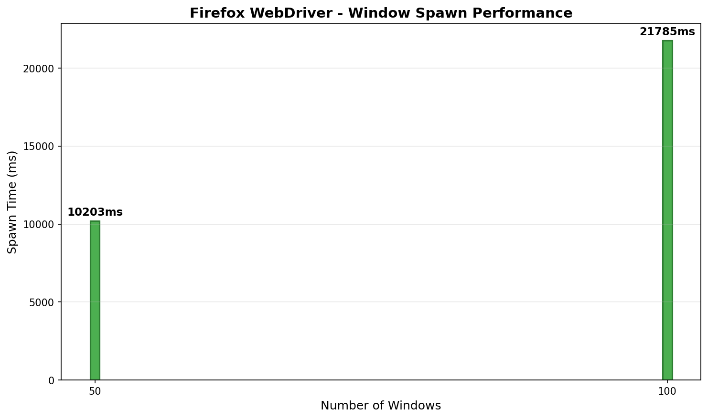
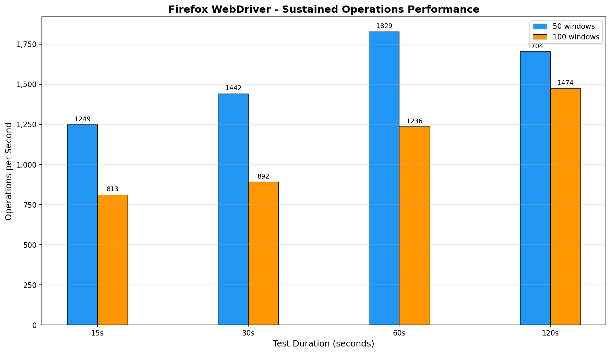

# Firefox-WebDriver

High-performance Firefox WebDriver in Rust

## Features

| Feature      | Description                                          |
| ------------ | ---------------------------------------------------- |
| Undetectable | No `navigator.webdriver` flag, no detectable globals |
| Event-driven | DOM mutations and network events push to client      |
| CSP bypass   | Script execution via `browser.scripting` API         |
| Parallel     | 300+ concurrent Windows supported                    |

## Architecture

```
Rust Application
    │
    ├── Driver ──► ConnectionPool (single WebSocket port)
    │                   │
    │                   ├── Window 1 ──► Tab ──► Element
    │                   ├── Window 2 ──► Tab ──► Element
    │                   └── Window N ──► Tab ──► Element
    │
    └── All windows share one WebSocket server
            │
            ▼
Firefox + Extension (multiple instances)
    │
    ├── Background Script (command router)
    └── Content Script (DOM access)
```

Each Window owns:

- One Firefox process
- Reference to shared ConnectionPool
- One profile directory

## Requirements

- Rust 1.92+
- Firefox 148+
- tokio 1.48+

## Installation

```toml
[dependencies]
firefox-webdriver = "0.1.1"
tokio = { version = "1.48", features = ["full"] }
```

## Commands

### Build

| Command      | Description            |
| ------------ | ---------------------- |
| `make build` | Build release          |
| `make check` | Check without building |
| `make doc`   | Generate docs          |

### Test

| Command            | Description                           |
| ------------------ | ------------------------------------- |
| `make test`        | Run tests                             |
| `make run-example` | Run example (EXAMPLE=01_basic_launch) |

### Quality

| Command       | Description |
| ------------- | ----------- |
| `make format` | Format code |
| `make lint`   | Run clippy  |

### Clean

| Command      | Description     |
| ------------ | --------------- |
| `make clean` | Clean artifacts |

## Usage

```rust
use firefox_webdriver::{Driver, Result};

#[tokio::main]
async fn main() -> Result<()> {
    let driver = Driver::builder()
        .binary("/usr/bin/firefox")
        .extension("./extension")
        .build()
        .await?;

    let window = driver.window().headless().spawn().await?;
    let tab = window.tab();

    // Navigate to example.com
    tab.goto("https://example.com").await?;
    let title = tab.get_title().await?;
    println!("Title: {}", title);

    // Find the main heading
    let heading = tab.find_element("h1").await?;
    let text = heading.get_text().await?;
    println!("Heading: {}", text);

    // Find the link on the page
    let link = tab.find_element("a").await?;
    let href = link.get_attribute("href").await?;
    println!("Link href: {:?}", href);

    window.close().await?;
    Ok(())
}
```

## Examples

| Example                      | Description                        |
| ---------------------------- | ---------------------------------- |
| `001_basic_launch.rs`        | Driver setup, window, profile      |
| `002_navigation.rs`          | Navigate, back, forward, reload    |
| `003_script_execution.rs`    | Sync/async JavaScript execution    |
| `004_element_query.rs`       | Find elements, properties          |
| `005_element_interaction.rs` | Click, type, focus, blur           |
| `006_storage.rs`             | Cookies, localStorage              |
| `007_frame_switching.rs`     | iframe navigation                  |
| `008_element_observer.rs`    | MutationObserver, wait_for_element |
| `009_proxy.rs`               | HTTP/SOCKS5 proxy configuration    |
| `010_network_intercept.rs`   | Block rules, request interception  |
| `011_canvas_fingerprint.rs`  | Canvas randomization test          |
| `012_multi_window.rs`        | Multi-window stress test           |

```bash
cargo run --example 001_basic_launch
cargo run --example 001_basic_launch -- --no-wait  # Auto-close
cargo run --example 001_basic_launch -- --debug    # Debug logging
```

## Benchmarks

Performance benchmarks for multi-window operations.

### Run Benchmarks

```bash
# Run benchmark suite (outputs CSV)
cargo run --release --example bench_runner

# Generate plots (requires matplotlib)
pip install matplotlib
python3 benches/plot_results.py
```

### Results

Benchmarks run with varying window counts (50, 100) and durations (15s, 30s, 60s, 120s).

#### Window Spawn Time



#### Sustained Operations



## Documentation

| Document                                   | Description            |
| ------------------------------------------ | ---------------------- |
| [Getting Started](docs/getting-started.md) | Quick start guide      |
| [API Reference](docs/api/)                 | Type and method docs   |
| [Guides](docs/guides/)                     | How-to guides          |
| [Architecture](ARCHITECTURE.md)            | Protocol specification |

## License

Apache-2.0 - see [LICENSE](LICENSE)
